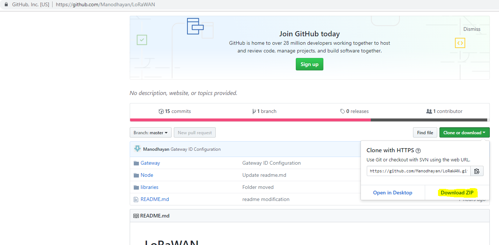
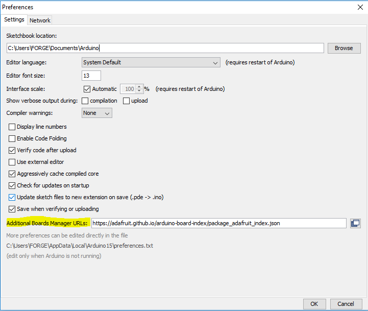
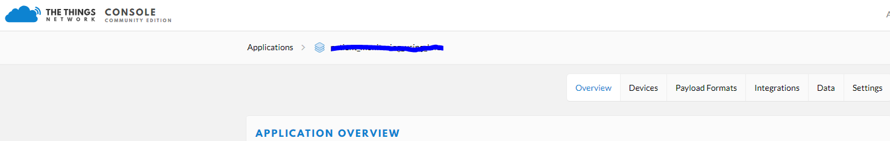
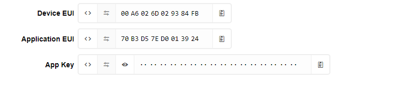
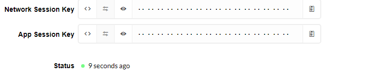

# LoRa Node - Adafruit Feather 32u4
## Step 0: Download and extract this repository on your windows machine before proceeding.<br>


Extract the downloaded zip.For convinience, Extract the zip folder into desktop.

## Step 1: Setting up the environment
- Install [Arduino](https://www.arduino.cc/download_handler.php?f=/arduino-1.8.7-windows.exe)
- Open the download zip folder and navigate to LoRaWAN->libraries. Copy all files in this folder.
- Now, Open Documents->Arduino->libraries, paste the copied files into this folder.
- Open Arduino (Search Arduino in start). Click on File Menu -> Preferences.
- Preference window will pop-up
    - Paste this url https://adafruit.github.io/arduino-board-index/package_adafruit_index.json in Additional Boards Manager


Then press OK.
- Now, Click on Tools->Board->Boards Manager. It will download the list of boards availabe. It might take few seconds.
- Search for Adafruit Feather 32u4. Results get filtered and only one will remain. Click on that and press install (if you haven't before).

<br><br>
Great Work!. Environment is ready to use.

## Step 2: Node Registration
- Follow this tutorial to register your node
https://www.thethingsnetwork.org/docs/devices/registration.html
.<br>Make sure you register in OTAA(Over the Air Activation) mode not as ABP (Active by Personalisation)

## Step 4: Entering your Credentials
You can find your credentials on Applications->Your Application<br>


On Devices tab. Navigate into your device and find your credentials


Find lora_device_1.ino in Node subdirectory of your extracted folder.
- Device EUI
<br>
Click on <> to get formatted HEX address and then click on double arrow so that the hex formatted arrange as LSB to MSB. Click on Clipborad icon to copy the address.
<br><br>Find this line of code 

```
static const u1_t DEVEUI[8]  = { 0x00, 0x00, 0x00, 0x00, 0x00, 0x00, 0x00, 0x00 }; //Replace your DEVEUI -LSB->MSB
```

Replace this with your DEVEUI

- Application EUI
<br>
Click on <> to get formatted HEX address and then click on double arrow so that the hex formatted arrange as LSB to MSB. Click on Clipborad icon to copy the address.
<br><br>Find this line of code

```
static const u1_t APPEUI[8] = { 0x9D, 0x1D, 0x01, 0xD0, 0x7E, 0xD5, 0xB3, 0x70 };//Replace your APPEUI -LSB->MSB
```

Replace this with your APPEUI

 - Application Key (App Key)
<br>
This time don't click on <> because this needs to be MSB to LSB. So just click on Clipborad icon to copy the address.
<br><br>Find this line of code

```
static const u1_t APPKEY[16] = { 0x22, 0x8E, 0xC0, 0xB4, 0x91, 0xFD, 0x39, 0xA0, 0x3E, 0xE0, 0xAC, 0xD7, 0x67, 0x4A, 0x5E, 0x17 };//Replace your APPKEY -MSB->LSB
```

Replace this with your APPKEY

<b>Note: Further steps suits only for Adafruit Feather 32u4</b>
 ## Step 4: Configure LoRa Node*
 This is the most important step. You might need datasheet for you node. Make sure you are using Adafruit Feather 32u4 and verify the pin numbers.
 Find this chunk of code and do the verification.
 ```
 const lmic_pinmap lmic_pins = {
    .nss = 8,
    .rxtx = LMIC_UNUSED_PIN,
    .rst = 1,
    .dio = {7,6,LMIC_UNUSED_PIN},
};
 ```
 Once, done proceed below
## Step 6 : Testing Connection
Just Upload the code to your board and go to Devices tab in your things network application and click on your device.

Check the status of your device after successful upload.
Note: Make sure you have a gateway that is established properly near to your location. It doesn't matter whether you own it or not.



 ## Step 5: Practice your code
 If you are interfacing any sensor, Like I used DHT 11 to measure temperature and humidity. First interface with Adafruit Feather 32u4 just like Arduino.
 Check whether everything works fine. Okay let's move on

 ## Step 6: Dump your code
Find do_send(osjob_t* j) function in lora_device_1.ino. Copy the code in void loop() of your practice code and paste in the first line of do_send(osjob_t* j) function in lora_device_1.ino.<br><br>
In my case, I'm just measuring temperature and humidity and assigning into a variable.

In LoRa, you can send you data as packets. Each packet can contain several bytes. So you have to store your data into a byte array.
I named my byte array as buffer. I prefer you to use the same name else you have to modify your byte name array in the line shown below.
```
LMIC_setTxData2(1, (uint8_t*) buffer, sizeof(buffer) , 0);
```
This will be available at the last line of do_send(osjob_t* j) function .
Syntax is
```
LMIC_setTxData2(port, (uint8_t*) byte_array, size_of_byte_array ,pending_data);
```
-  port-The port you are going to access in Gateway<br>
- byte_array- Byte array variable<br> 
- size_of_byte_array- Size of your byte array<br>
- pending_data - We are saying that no data is pending so far
<br><br>
Note: This might not works for all the cases. You have to apply your own coding skills for complex data handling operations.

Okay, Now store your data one by into a byte array. A byte can store value less than 256 (2^8).
For better understanding of storing your data into byte array. Go through this link [Payload Format ](https://www.youtube.com/watch?v=nT2FnwCoP7w). This tutorial will be cover upto payload decoding at Things Network.

## Congratulations
You have successfully made your data transmission.